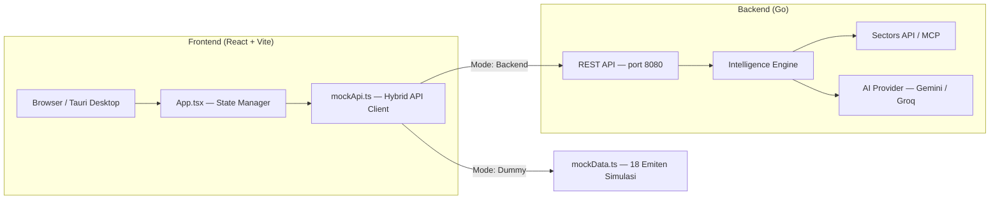
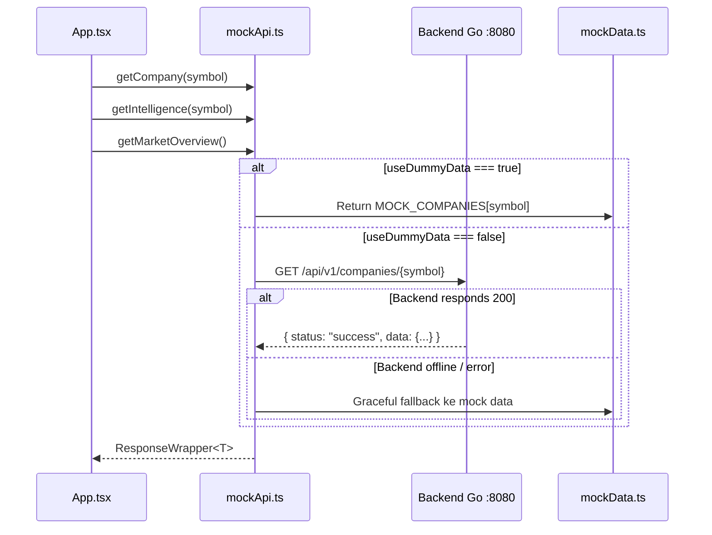
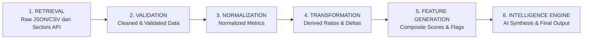

# 📘 Marketidex — Market Intelligence Platform

> Dokumentasi Teknis Lengkap untuk Tim Pengembang

---

## 1. Gambaran Umum Aplikasi

**Marketidex** adalah platform analisis intelijen pasar saham Indonesia (IDX) yang menggabungkan data finansial dari **Sectors API / MCP** dengan pemrosesan AI (Gemini / Groq) untuk menghasilkan *derived intelligence* berupa skor peluang, skor risiko, deteksi anomali, dan narasi riset otomatis.

### Arsitektur Tingkat Tinggi



### Tech Stack

| Layer | Teknologi | Versi |
|---|---|---|
| **Frontend Framework** | React + TypeScript | React 19.2, TS 6.0 |
| **Build Tool** | Vite | 8.3.0 |
| **Styling** | Tailwind CSS v4 | 4.3.3 |
| **Charting** | Recharts | 3.10.1 |
| **Icons** | Lucide React | 1.47.0 |
| **Font** | IBM Plex Sans & Mono (`@fontsource`, di-bundle lokal) | 5.x |
| **Desktop Wrapper** | Tauri v2 | 2.11.5 |
| **Backend** | Go (net/http) | — |
| **AI Provider** | Google Gemini / Groq | gemini-3.5-flash |

---

## 2. Cara Menjalankan

### Frontend (Development)

```bash
cd d:\Hackaton\fe
npm install
npm run dev          # → http://localhost:5173
```

### Backend Go

```bash
cd d:\Hackaton\market-intellegence
go run cmd/api/main.go    # → http://localhost:8080
```

### Desktop App (Tauri — Opsional)

```bash
cd d:\Hackaton\fe
npx tauri dev
```

### Environment Variable (Opsional)

Buat file `.env` di root `fe/` jika URL backend bukan default:

```env
VITE_API_BASE_URL=http://localhost:8080
```

---

## 3. Struktur Direktori Frontend

```
d:\Hackaton\fe\
├── src/
│   ├── main.tsx                          # Entry point React
│   ├── App.tsx                           # Root component, global state, hash routing
│   ├── index.css                         # Design token (warna light/dark, font, utilitas)
│   │
│   ├── lib/
│   │   ├── format.ts                     # Formatter angka/tanggal, label Indonesia, aturan kuadran
│   │   ├── theme.ts                      # Tema light/dark + palet warna chart
│   │   └── ui.ts                         # Helper `cx` & mapping arah → tone
│   │
│   ├── types/
│   │   └── api.ts                        # Seluruh TypeScript interface (21+ types)
│   │
│   ├── services/
│   │   ├── mockApi.ts                    # Hybrid API client (real fetch + dummy fallback)
│   │   └── mockData.ts                   # Dataset simulasi 18 emiten IDX (49KB)
│   │
│   ├── components/
│   │   ├── Navbar.tsx                    # Top bar: wordmark, tombol pencarian, status sumber data, toggle tema
│   │   ├── Sidebar.tsx                   # Navigasi 5 view + watchlist, bisa diciutkan, drawer di mobile
│   │   │
│   │   ├── ui/
│   │   │   └── primitives.tsx            # Panel, PageHeader, Tag, ScoreBar, Stat, Segmented, SortHeader, dll.
│   │   │
│   │   ├── views/                        # Halaman utama (1 per menu sidebar)
│   │   │   ├── MarketOverview.tsx         # Ikhtisar pasar, Top 10 chart, direktori emiten
│   │   │   ├── SignalIntelligence.tsx      # Core Signal Engine per emiten
│   │   │   ├── CompanyDashboard.tsx        # Fundamental: growth, dividen, smart money
│   │   │   ├── MarketIntelligence.tsx      # Screener, makro, signal matrix
│   │   │   └── PortfolioAndAi.tsx         # AI Summary, portofolio, risiko bencana
│   │   │
│   │   └── shared/                       # Komponen reusable
│   │       ├── EmitenHeader.tsx          # Header bersama untuk halaman level emiten
│   │       ├── EmitenSwitcherModal.tsx    # Command palette global (/, Ctrl+K)
│   │       ├── EvidencePanel.tsx          # Tabel bukti metrik vs peer median
│   │       ├── SectorsPipelineInspector.tsx  # Pipeline inspector + toggle dummy/backend
│   │       ├── SignalMatrix.tsx           # Scatter plot kuadran opportunity vs risk
│   │       └── WatchlistButton.tsx        # Tombol tambah/hapus watchlist
│   │
│   └── assets/                           # Gambar statis (hero.png, svg)
│
├── src-tauri/                            # Konfigurasi Tauri desktop wrapper
│   ├── tauri.conf.json
│   ├── Cargo.toml
│   └── src/                              # Rust boilerplate
│
├── package.json
├── vite.config.ts
├── tsconfig.json / tsconfig.app.json / tsconfig.node.json
└── index.html
```

---

## 4. Alur Data & State Management

### Global State ([`App.tsx`](file:///d:/Hackaton/fe/src/App.tsx))

Aplikasi menggunakan **React State + Props Drilling** (tanpa Redux/Zustand). Semua state kritis di-*lift* ke `App.tsx`:

| State | Tipe | Fungsi |
|---|---|---|
| `selectedSymbol` | `string` | Kode emiten yang sedang aktif (`'BBCA'`) |
| `currentView` | `ViewType` | Halaman yang aktif (`'overview'`, `'signals'`, dst.) |
| `company` | `Company \| null` | Data profil emiten aktif |
| `intelligence` | `IntelligenceSnapshot \| null` | Skor & analisis AI emiten aktif |
| `marketOverview` | `MarketOverview \| null` | Agregasi pasar: top opportunities, risks, anomalies |
| `useDummyData` | `boolean` | Mode sumber data (dummy vs backend) |
| `isSidebarOpen` | `boolean` | Toggle sidebar terbuka/tertutup |
| `isPipelineOpen` | `boolean` | Toggle modal Pipeline Inspector |
| `isSearchOpen` | `boolean` | Command palette pencarian emiten |
| `isMobileNavOpen` | `boolean` | Drawer navigasi di layar kecil |
| `theme` | `'light' \| 'dark'` | Tema aktif, disimpan di `localStorage` (`marketidex_theme`) |
| `watchlist` | `string[]` | Daftar emiten yang di-watch, disimpan di `localStorage` (`marketidex_watchlist`) |
| `companies` | `Company[]` | Daftar emiten dari `getCompanies()` untuk pencarian & direktori |
| `dataOrigin` | `'backend' \| 'dummy' \| 'fallback'` | Asal data terakhir; `fallback` = backend gagal dan data simulasi dipakai |
| `loading` | `boolean` | Status loading data (konten lama tetap tampil, bar tipis di top bar) |

### Routing

View dan emiten aktif disimpan di hash URL: `#/<view>/<SYMBOL>` (mis. `#/signals/GOTO`). Halaman bisa di-bookmark dan tombol back browser berfungsi.

### Pelaporan Asal Data

Setiap pemanggilan di `mockApi.ts` memancarkan event `marketidex_data_origin`. `App.tsx` mengumpulkannya per siklus load; jika ada satu saja `fallback`, top bar menampilkan **Backend offline** agar data simulasi tidak dikira data live.

### Alur Fetch Data



### Response Envelope

Semua respons (dari backend maupun mock) menggunakan format standar:

```typescript
interface ResponseWrapper<T> {
  status: "success" | "error";
  data?: T;
  message?: string;
}
```

---

## 5. Hybrid API Client ([`mockApi.ts`](file:///d:/Hackaton/fe/src/services/mockApi.ts))

File ini adalah **jantung komunikasi data** aplikasi. Fitur utama:

### Mode Data Source (Toggle)

```typescript
// Baca & simpan preferensi di localStorage
export const isDummyMode = (): boolean => useDummyData;
export const setDummyMode = (enabled: boolean): void => { ... };
```

- **Mode Dummy (`ON`)**: Seluruh data diambil dari `mockData.ts` (18 emiten lokal, tanpa network call).
- **Mode Backend (`OFF`)**: Data diambil dari Go API via HTTP fetch, dengan **auto-fallback** ke mock jika backend mati.

### Normalization Layer

Backend Go mengirim `direction: "Bullish"` (Title Case), sementara frontend mengecek `=== 'BULLISH'` (UPPER CASE). Fungsi `normalizeIntelligence()` secara otomatis menstandarkan format ini:

```typescript
function normalizeIntelligence(raw: any): IntelligenceSnapshot {
  return {
    ...raw,
    direction: String(raw.direction).toUpperCase(),  // "Bullish" → "BULLISH"
    confidence: String(raw.confidence).toUpperCase(), // "High" → "HIGH"
    // ... menjamin semua array field tidak undefined
  };
}
```

### Endpoint yang Tersedia

| # | Method | Endpoint | Fungsi di `apiService` |
|---|---|---|---|
| 1 | `GET` | `/api/v1/health` | `getHealth()` |
| 2 | `GET` | `/api/v1/companies` | `getCompanies()` |
| 3 | `GET` | `/api/v1/companies/{symbol}` | `getCompany(symbol)` |
| 4 | `GET` | `/api/v1/companies/{symbol}/intelligence` | `getIntelligence(symbol)` |
| 5 | `GET` | `/api/v1/companies/{symbol}/anomalies` | `getAnomalies(symbol)` |
| 6 | `GET` | `/api/v1/companies/{symbol}/peers` | `getPeers(symbol)` |
| 7 | `GET` | `/api/v1/market/overview` | `getMarketOverview()` |
| 8 | `POST` | `/api/v1/screener` | `runScreener(filter)` |

---

## 6. Halaman & Fitur Utama

### 6.1 Ringkasan pasar — Market Overview ([`MarketOverview.tsx`](file:///d:/Hackaton/fe/src/components/views/MarketOverview.tsx)) — 769 baris

**Halaman landing utama.** Menampilkan kondisi pasar IDX secara menyeluruh.

| Section | Deskripsi |
|---|---|
| **Ringkasan angka** | Jumlah emiten, sebaran bullish/netral/bearish, rata-rata skor peluang, jumlah anomali |
| **Peluang / Risiko tertinggi / Anomali** | Daftar berperingkat dengan score bar |
| **Tren skor peluang** | Line chart 10 emiten; satu emiten disorot, sisanya abu-abu |
| **Sektor** | Tabel sentimen & rata-rata peluang per sektor |
| **Semua emiten** | Tabel sortable + filter teks & sektor, tombol watchlist per baris |

### 6.2 Sinyal — Core Signal Engine ([`SignalIntelligence.tsx`](file:///d:/Hackaton/fe/src/components/views/SignalIntelligence.tsx)) — 383 baris

**Analisis mendalam per emiten.** Fitur:

- Skor peluang & risiko dengan label yang diturunkan dari nilai (mis. "Kuat", "Risiko tinggi"), keyakinan model, status anomali/divergensi
- Peringatan divergensi yang teksnya mengikuti arah sinyal (positif/negatif)
- **Temuan utama**: `finding` + `explanation` dari Standardized Signal Output, atau ringkasan AI jika belum ada
- **Faktor pendorong / penekan / katalis** (`positive_factors`, `negative_factors`, `supporting_factors`)
- **Yang berubah**: tabel delta antar-periode, warna dampak mengikuti `impact`
- **Evidence Panel**: bukti kinerja & valuasi vs median peer, plus sinyal terkait

### 6.3 Fundamental — Company Intelligence ([`CompanyDashboard.tsx`](file:///d:/Hackaton/fe/src/components/views/CompanyDashboard.tsx)) — 246 baris

**Dashboard fundamental perusahaan.** Jika data suatu emiten belum ada, panel menampilkan empty state — tidak lagi diam-diam memakai data BBCA. Bagian:

| Tab | Data |
|---|---|
| **Pertumbuhan Finansial** | Grafik bar chart Revenue, Net Profit, Margin (5 tahun) |
| **Riwayat Dividen** | DPS, Yield %, Payout Ratio per tahun |
| **Pemegang Saham** | Porsi kepemilikan (Institutional, Government, Retail, Management) |
| **Direksi & Insider** | Aksi beli/jual direksi + tenure |
| **Smart Money Flow** | Tabel transaksi akumulasi/distribusi institusi |

### 6.4 Screener & sektor ([`MarketIntelligence.tsx`](file:///d:/Hackaton/fe/src/components/views/MarketIntelligence.tsx)) — 278 baris

**Filter dan discovery saham.** Fitur:

- **Screener**: filter sektor (dari data), peluang minimum, risiko maksimum, anomali/divergensi — diterapkan langsung (debounce 200 ms), hasil sortable
- **Peta peluang vs risiko** ([`SignalMatrix.tsx`](file:///d:/Hackaton/fe/src/components/shared/SignalMatrix.tsx)): scatter seluruh emiten, dihitung dari `MOCK_INTELLIGENCE` dengan aturan kuadran di `lib/format.ts` (peluang ≥ 60, risiko < 50)
- **Indikator makro** & **Dampak peristiwa**

### 6.5 Portofolio & riset ([`PortfolioAndAi.tsx`](file:///d:/Hackaton/fe/src/components/views/PortfolioAndAi.tsx)) — 213 baris

**Ringkasan AI dan analisis portofolio.** Fitur:

- **Ringkasan riset**: narasi LLM (`ai_research_summary`) untuk emiten aktif + disclaimer
- **Alokasi**: portofolio contoh, risiko & peluang tertimbang, sektor terbesar
- **Catatan risiko**: dihitung dari aturan (posisi risiko ≥ 60 maks. 10%, satu sektor maks. 35%)
- **Risiko bencana & operasional**

---

## 7. Komponen Shared (Reusable)

| Komponen | File | Fungsi |
|---|---|---|
| **EmitenSwitcherModal** | [`EmitenSwitcherModal.tsx`](file:///d:/Hackaton/fe/src/components/shared/EmitenSwitcherModal.tsx) | Command palette global (dibuka dari top bar, tombol "Ganti emiten", `/`, atau `Ctrl+K`). Watchlist tampil di atas, navigasi keyboard. |
| **EmitenHeader** | [`EmitenHeader.tsx`](file:///d:/Hackaton/fe/src/components/shared/EmitenHeader.tsx) | Header halaman level emiten: kode, nama, sektor, arah, anomali, kap. pasar, tombol watchlist & ganti emiten. |
| **EvidencePanel** | [`EvidencePanel.tsx`](file:///d:/Hackaton/fe/src/components/shared/EvidencePanel.tsx) | Tabel perbandingan metrik emiten vs median peer (P/E, ROE, Growth, dll). |
| **SectorsPipelineInspector** | [`SectorsPipelineInspector.tsx`](file:///d:/Hackaton/fe/src/components/shared/SectorsPipelineInspector.tsx) | Dialog sumber data (Backend/Simulasi), status backend, dan 6 tahap pipeline. Dibuka dari indikator status di top bar. |
| **SignalMatrix** | [`SignalMatrix.tsx`](file:///d:/Hackaton/fe/src/components/shared/SignalMatrix.tsx) | Scatter peluang vs risiko; emiten aktif disorot, anomali diberi cincin kuning. |
| **WatchlistButton** | [`WatchlistButton.tsx`](file:///d:/Hackaton/fe/src/components/shared/WatchlistButton.tsx) | Toggle button star untuk menambah/hapus emiten dari watchlist. |

---

## 8. Design System & Styling

Gaya visual: terminal riset yang tenang — permukaan netral, garis tipis, tanpa glassmorphism, glow, atau gradien dekoratif. Warna hanya dipakai jika punya makna.

### Token Warna ([`index.css`](file:///d:/Hackaton/fe/src/index.css))

Semua warna berupa CSS variable yang nilainya berganti lewat `data-theme` di `<html>`, lalu dipetakan ke utility Tailwind (`bg-surface`, `text-ink-2`, `border-line`, dst.).

| Token | Penggunaan |
|---|---|
| `canvas` / `surface` / `surface-2` | Latar halaman, panel, dan elemen sekunder (hover, track bar) |
| `line` / `line-strong` | Border & pemisah |
| `ink` / `ink-2` / `ink-3` | Teks utama, sekunder, dan keterangan |
| `accent` | Elemen interaktif aktif, skor peluang, emiten yang disorot di chart |
| `up` / `down` | Bullish / bearish, perubahan positif / negatif |
| `warn` | Anomali, divergensi, peringatan |

Aturan: `up`/`down`/`warn` **hanya** untuk makna tersebut, bukan dekorasi. Warna chart (Recharts butuh hex) ada di `CHART_COLORS` dalam [`lib/theme.ts`](file:///d:/Hackaton/fe/src/lib/theme.ts) dan harus sinkron dengan `index.css`.

### Tipografi

- **UI**: IBM Plex Sans, body 14px, judul halaman 22px semibold, judul panel 13px semibold, kalimat biasa (bukan UPPERCASE).
- **Angka & kode emiten**: IBM Plex Mono dengan tabular figures (class `num`).

### Komponen Dasar ([`primitives.tsx`](file:///d:/Hackaton/fe/src/components/ui/primitives.tsx))

`PageHeader`, `Panel`, `Stat`, `Tag`, `DirectionTag`, `ScoreBar`, `Segmented`, `SortHeader`, `Button`, `Kbd`, `EmptyState`. Gunakan komponen ini alih-alih menulis ulang kelas Tailwind di setiap view.

### Chart

- Garis grid solid tipis, tanpa dash.
- Banyak seri → sorot satu seri dengan `accent`, sisanya abu-abu (lihat tren skor peluang).
- Tidak ada chart dua sumbu-Y.
- Tooltip kustom memakai token yang sama dengan UI.

## 9. TypeScript Interfaces Utama ([`api.ts`](file:///d:/Hackaton/fe/src/types/api.ts))

File ini mendefinisikan **21+ interfaces**. Yang paling kritis:

| Interface | Baris | Digunakan Oleh |
|---|---|---|
| `ResponseWrapper<T>` | Semua API call | Envelope standar response |
| `Company` | Navbar, Dashboard, Overview | Profil emiten |
| `IntelligenceSnapshot` | SignalEngine, Screener, Overview | **Inti data AI** — 20+ field |
| `MarketOverview` | Market Overview | Agregasi 4 kategori pasar |
| `ScreenerFilter` | MarketIntelligence | Parameter POST screener |
| `EvidenceItem` | EvidencePanel | Metrik vs peer median |
| `WhatChangedItem` | SignalIntelligence | Delta antar-periode |
| `PeerComparisonItem` | EvidencePanel | Posisi valuasi vs peers |
| `GrowthData` | CompanyDashboard | Revenue, Profit, Margin tahunan |
| `SignalMatrixPoint` | SignalMatrix | Titik scatter plot kuadran |
| `PipelineStage` | PipelineInspector | Tahapan pengolahan data Sectors |
| `StandardizedSignalOutput` | SignalIntelligence | Output sinyal terstruktur |
| `MacroIndicator` | MarketIntelligence | Indikator ekonomi makro |
| `PortfolioPosition` | PortfolioAndAi | Alokasi portofolio simulasi |

---

## 10. Mock Data ([`mockData.ts`](file:///d:/Hackaton/fe/src/services/mockData.ts)) — 1228 baris, 49KB

Dataset simulasi **18 emiten IDX** lengkap:

**Emiten**: BBCA, BBRI, BMRI, BBNI, TLKM, ASII, ICBP, UNVR, CPIN, ADRO, PTBA, AMMN, KLBF, PGAS, GOTO, BUKA, ARTO, EMTK

> [!NOTE]
> Data fundamental (growth, dividen, pemegang saham, direksi, smart money) baru tersedia untuk **BBCA** (growth juga **TLKM**). Emiten lain menampilkan empty state di halaman Fundamental. `MOCK_SIGNAL_OUTPUTS` baru ada untuk BBCA dan GOTO.

**Data yang Tersedia per Emiten**:

| Export | Isi |
|---|---|
| `MOCK_COMPANIES` | Record 18 profil emiten (symbol, name, sector, market_cap) |
| `MOCK_INTELLIGENCE` | Record 18 intelligence snapshot (skor, faktor, evidence, AI summary) |
| `MOCK_MARKET_OVERVIEW` | Agregasi top_opportunities, top_risks, detected_anomalies, sector_summary |
| `MOCK_GROWTH_DATA` | Data pertumbuhan finansial 5 tahun (revenue, profit, margin) |
| `MOCK_DIVIDENDS` | Riwayat dividen 4 tahun (DPS, yield, payout) |
| `MOCK_SHAREHOLDERS` | Struktur pemegang saham per emiten |
| `MOCK_EXECUTIVES` | Data direksi & insider action |
| `MOCK_SMART_MONEY` | Transaksi smart money (akumulasi/distribusi) |
| `MOCK_MACRO` | 4 indikator makroekonomi (BI Rate, Inflasi, Kurs, GDP) |
| `MOCK_EVENTS` | 4 event dampak pasar |
| `MOCK_DISASTER_RISKS` | 4 risiko bencana regional |
| `MOCK_PORTFOLIO` | 5 posisi portofolio simulasi |
| `MOCK_SIGNAL_MATRIX` | 10 titik scatter (tidak lagi dipakai UI; peta kuadran dihitung dari `MOCK_INTELLIGENCE`) |
| `MOCK_PIPELINE_STAGES` | 6 tahap pipeline Sectors API |
| `MOCK_SIGNAL_OUTPUTS` | Signal output terstruktur per emiten |
| `MOCK_TOP10_GROWTH_TIMELINE` | Data time-series 12 bulan untuk chart Top 10 |

---

## 11. Pipeline Data Sectors API

Alur pengolahan data dari mentah hingga menjadi insight:



Pipeline ini divisualisasikan secara interaktif di modal **Pipeline Inspector** yang bisa dibuka dari indikator status sumber data (Live / Simulasi / Backend offline) di top bar.

---

## 12. Backend API — Endpoint Mapping ke Frontend

| Backend Endpoint | Frontend Component | Status |
|---|---|---|
| `GET /api/v1/health` | SectorsPipelineInspector (badge & diagnostik) | ✅ Terhubung |
| `GET /api/v1/companies` | Navbar search, EmitenSwitcherModal, Market directory | ✅ Terhubung |
| `GET /api/v1/companies/{symbol}` | CompanyDashboard header | ✅ Terhubung |
| `GET /api/v1/companies/{symbol}/intelligence` | SignalIntelligence, EvidencePanel, PortfolioAndAi | ✅ Terhubung |
| `GET /api/v1/companies/{symbol}/anomalies` | SignalIntelligence anomaly section | ✅ Terhubung |
| `GET /api/v1/companies/{symbol}/peers` | EvidencePanel peer comparison | ✅ Terhubung |
| `GET /api/v1/market/overview` | MarketOverview (4 sections) | ✅ Terhubung |
| `POST /api/v1/screener` | MarketIntelligence screener | ✅ Terhubung |

> [!IMPORTANT]
> Backend saat ini memiliki **5 emiten** in-memory (BBCA, TLKM, ASII, AMRT, GOTO). Frontend memiliki **18 emiten** di mock data. Emiten yang belum ada di backend akan otomatis di-fallback ke data dummy.

---

## 13. Data yang Masih Hanya di Frontend (Belum Ada di Backend)

| Data | Dipakai Oleh | Keterangan |
|---|---|---|
| Pertumbuhan Finansial Tahunan (`GrowthData`) | CompanyDashboard chart | 5 tahun revenue/profit/margin |
| Riwayat Dividen (`DividendHistory`) | CompanyDashboard | DPS, yield, payout ratio |
| Pemegang Saham (`Shareholder`) | CompanyDashboard | Porsi institutional/retail/govt |
| Direksi & Insider (`KeyExecutive`) | CompanyDashboard | Insider action (buy/sell/hold) |
| Smart Money Flow (`SmartMoneyTransaction`) | CompanyDashboard | Transaksi institusi |
| Makro Ekonomi (`MacroIndicator`) | MarketIntelligence | BI Rate, Inflasi, Kurs, GDP |
| Event Impact (`EventImpact`) | MarketIntelligence | Dampak events ke harga |
| Risiko Bencana (`DisasterRisk`) | PortfolioAndAi | Risiko regional |
| Growth Timeline Top 10 | MarketOverview chart | Time-series 12 bulan |
| Portfolio & Watchlist | PortfolioAndAi, WatchlistButton | Disimpan di memori browser |

---

## 14. Konvensi & Aturan Pengembangan

### Penamaan File

- **Views** (halaman utama): `PascalCase.tsx` di `src/components/views/`
- **Shared** (reusable): `PascalCase.tsx` di `src/components/shared/`
- **Services**: `camelCase.ts` di `src/services/`
- **Types**: `camelCase.ts` di `src/types/`

### Pola Komponen

```typescript
// Setiap komponen mengikuti pola ini:
interface ComponentProps {
  // Props yang diterima
}

export const ComponentName: React.FC<ComponentProps> = ({ prop1, prop2 }) => {
  // State lokal
  // Logic
  return ( <JSX /> );
};
```

### Penambahan Emiten Baru

1. Tambahkan entry di `MOCK_COMPANIES` (mockData.ts)
2. Tambahkan entry di `MOCK_INTELLIGENCE` (mockData.ts)
3. Opsional: Tambahkan data growth, dividen, shareholders, executives, smart money
4. Emiten otomatis muncul di search bar, switcher modal, dan market overview

### Penambahan View Baru

1. Buat file baru di `src/components/views/NamaView.tsx`
2. Tambahkan `ViewType` di `Sidebar.tsx` (`export type ViewType = ... | 'nama-baru'`)
3. Tambahkan menu item di salah satu array (`marketItems`, `emitenItems`, `portfolioItems`) di `Sidebar.tsx`
4. Tambahkan id view ke array `VIEWS` di `App.tsx` (untuk routing hash) dan conditional render-nya
5. Mulai halaman dengan `PageHeader` (atau `EmitenHeader` untuk view level emiten) dan susun isinya dengan `Panel`

---

## 15. Perintah yang Tersedia

```bash
npm run dev       # Development server (Vite, port 5173)
npm run build     # TypeScript compile + Vite production build
npm run preview   # Preview production build
npm run lint      # Oxlint linter
npx tauri dev     # Jalankan sebagai desktop app (Tauri)
npx tauri build   # Build desktop installer
```

---

## 16. Ukuran File

Tabel ukuran file dihapus karena cepat usang. Gunakan `git ls-files src | xargs wc -l` untuk angka terkini.
